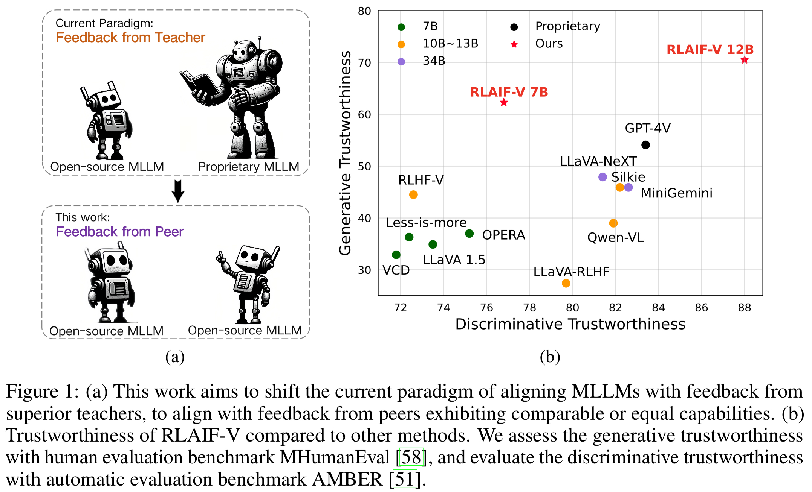
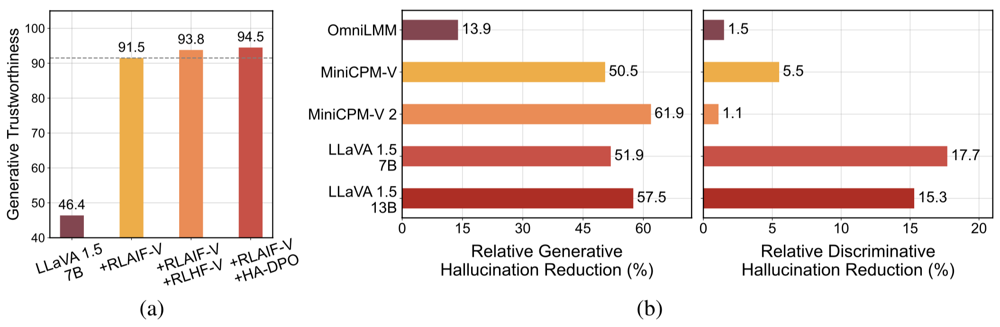
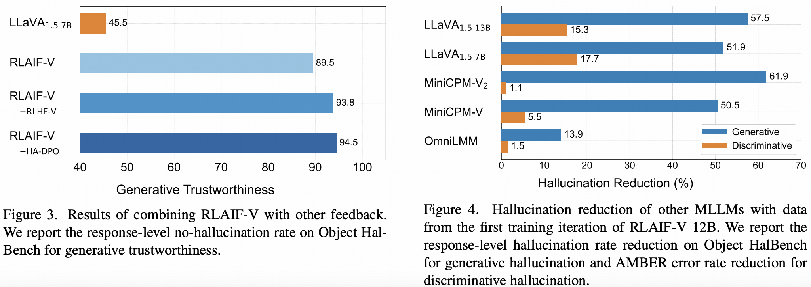

<div align="center" style="font-size: 15pt">


**Aligning MLLMs through Open-Source AI Feedback for Super GPT-4V Trustworthiness**

<a href='https://arxiv.org/abs/2405.17220'></a>
<a href='https://huggingface.co/datasets/openbmb/RLAIF-V-Dataset'></a>
<a href='https://huggingface.co/openbmb/RLAIF-V-7B'></a>
<a href='https://huggingface.co/openbmb/RLAIF-V-12B'></a>

<h4 align="center">
    <p>
        <a href="README_zh.md">中文</a> | <b>English</b>
    </p>
</h4>

</div>


## 🎊 News <!-- omit in toc -->

- [2024.11.26] 🚀 We support [LoRA](https://github.com/RLHF-V/RLAIF-V?tab=readme-ov-file#train) training now!
- [2024.05.28] 📃 Our paper is accesible at [arXiv](https://arxiv.org/abs/2405.17220) now!
- [2024.05.20] 🔥 Our [RLAIF-V-Dataset](https://huggingface.co/datasets/openbmb/RLAIF-V-Dataset) is used for training [MiniCPM-Llama3-V 2.5](https://huggingface.co/openbmb/MiniCPM-Llama3-V-2_5), which represents the first end-side  GPT-4V level MLLM!
- [2024.05.20] We open-source the code, weights ([7B](https://huggingface.co/openbmb/RLAIF-V-7B), [12B](https://huggingface.co/openbmb/RLAIF-V-12B)) and [data](https://huggingface.co/datasets/openbmb/RLAIF-V-Dataset) of RLAIF-V!


## 📜 Brief Introduction <!-- omit in toc -->

We introduce RLAIF-V, a novel framework that aligns MLLMs in a fully open-source paradigm for super GPT-4V trustworthiness.  RLAIF-V maximally exploits the open-source feedback from two key perspectives, including high-quality feedback data and online feedback learning algorithm. Notable features of RLAIF-V include:

* 💪 **Super GPT-4V Trustworthiness via Open-source Feedback**. By learning from open-source AI feedback, RLAIF-V 12B achieves super GPT-4V trustworthiness in both generative and discriminative tasks.

<table align="center">
    <p align="center">
      
    </p>
</table>


* 🤝 **High-quality Generalizable Feedback Data**. The feedback data usesed by RLAIF-V **effectively reduce the hallucination of different MLLMs**.

<table align="center">
    <p align="center">
      
    </p>
</table>


* ⚡️ **Efficient Feedback Learning with Iterative Alignment.** RLAIF-V exihibts both **better learning efficiency and higher performance** compared with the non-iterative approach.

<table align="center">
    <p align="center">
      
    </p>
</table>


## 📌Contents <!-- omit in toc -->

- [Dataset](#dataset)
- [Install](#install)
- [Model Weights](#model-weights)
- [Inference](#inference)
- [Data Generation](#data-generation)
- [Train](#train)
- [Evaluation](#evaluation)
  - [Object HalBench](#object-halbench)
  - [MMHal Bench](#mmhal-bench)
  - [RefoMB](#refomb)
- [Citation](#citation)

## Dataset

We present the [RLAIF-V Dataset](https://huggingface.co/datasets/openbmb/RLAIF-V-Dataset), which is an AI generated preference dataset covering diverse range of tasks and domains. This open-source multimodal preference datasets contains **83,132 high-quality comparison pairs**. The dataset contains the generated preference pairs in each training iteration of different models, including LLaVA 1.5 7B, OmniLMM 12B and MiniCPM-V.

## Install

1. Clone this repository and navigate to RLAIF-V folder
```bash
git clone https://github.com/RLHF-V/RLAIF-V.git
cd RLAIF-V
```

2. Install package
```bash
conda create -n rlaifv python=3.10 -y
conda activate rlaifv
pip install -e .
```
3. Install required spaCy model
```bash
wget https://github.com/explosion/spacy-models/releases/download/en_core_web_trf-3.7.3/en_core_web_trf-3.7.3.tar.gz
pip install en_core_web_trf-3.7.3.tar.gz
```


## Model Weights


| Model           | Description    | Download                                                    |
|-----------------|--------------------|:-:|
| RLAIF-V 7B  | The most trustworthy variant on LLaVA 1.5 | [🤗](https://huggingface.co/openBMB/RLAIF-V-7B) |
| RLAIF-V 12B | Based on OmniLMM-12B, achieving super GPT-4V trustworthiness. | [🤗](https://huggingface.co/openBMB/RLAIF-V-12B)           |

## Inference

We provide a simple example to show how to use RLAIF-V.


```python

from chat import RLAIFVChat, img2base64

chat_model = RLAIFVChat('openBMB/RLAIF-V-7B')  # or 'openBMB/RLAIF-V-12B'
image_path="./examples/test.jpeg"
msgs = "Describe in detail the people in the picture."
inputs = {"image": image_path, "question": msgs}
answer = chat_model.chat(inputs)
print(answer)

```


You can also run this example by executing the following script:

```bash
python chat.py
```

<details>
  <summary>
    <b>Inputs and expected outputs of the example</b>
  </summary>


<div align="center">

</div>

**Question:**

Why did the car in the picture stop?

**Expected outputs:**

In the picture, a car stopped on the road due to the presence of a sheep on the roadway. The car likely stopped to allow the sheep to safely move out of the way or avoid any potential accidents with the animal. This situation highlights the importance of being cautious and attentive while driving, especially in areas where animals may roam near roads.

</details>


## Data Generation
1. Environment Setup

We provide the OmniLMM 12B model and the MiniCPM-Llama3-V 2.5 model for feedback generation. If you wish to use the MiniCPM-Llama3-V 2.5 for giving feedback, please configure its inference environment according to the instructions in the [MiniCPM-V GitHub repository](https://github.com/OpenBMB/MiniCPM-V).

Please download our fine-tuned Llama3 8B models: [split model](https://thunlp.oss-cn-qingdao.aliyuncs.com/rlaifv_llama3_split_model.tar.gz) and [question transformation model](https://thunlp.oss-cn-qingdao.aliyuncs.com/rlaifv_llama3_changeq_model.tar.gz), and store them in the `./models/llama3_split` folder and the `./models/llama3_changeq` folder respectively.

2. OmniLMM 12B Model Feedback

The following script demonstrates using the LLaVA-v1.5-7b model to generate candidate answers and the OmniLMM 12B model to provide feedback.

```bash
mkdir ./results
bash ./script/data_gen/run_data_pipeline_llava15_omni.sh
```

3. MiniCPM-Llama3-V 2.5 Model Feedback

The following script demonstrates using the LLaVA-v1.5-7b model to generate candidate answers and the MiniCPM-Llama3-V 2.5 model to provide feedback. First, replace `minicpmv_python` in `./script/data_gen/run_data_pipeline_llava15_minicpmv.sh` with the Python path of the MiniCPM-V environment you created.

```bash
mkdir ./results
bash ./script/data_gen/run_data_pipeline_llava15_minicpmv.sh
```


## Train

1. Prepare data (Optional)

If you can access huggingface dataset, you can skip this step, we will automatically download the [RLAIF-V Dataset](https://huggingface.co/datasets/openbmb/RLAIF-V-Dataset).

If you already downloaded the dataset, you can replace 'openbmb/RLAIF-V-Dataset' to your dataset path [here](muffin/data/datasets.py#L38) at Line 38.

2. Training

Here, we provide a training script to train the model in **1 iteration**. The `max_step` parameter should be adjusted according to the amount of your data.

- **Fully Fine-tuning**
  
Run the following command to start fully fine-tuning.

```bash
bash ./script/train/llava15_train.sh
```

- **LoRA**

Run the following command to start lora training.

```bash
pip install peft 
bash ./script/train/llava15_train_lora.sh
```
3. Iterative alignment

To reproduce the iterative training process in the paper, you need to do the following steps for 4 times:
- **S1. Data generation.**

  Follow the instructions in [data generation](https://github.com/RLHF-V/RLAIF-V?tab=readme-ov-file#data-generation) to generate preference pairs for the base model. Convert the generated jsonl file to huggingface parquet.
- **S2. Change training config.**

  In dataset code, replace `'openbmb/RLAIF-V-Dataset'` [here](muffin/data/datasets.py#L38) to your data path.

  In [training script](script/train/llava15_train.sh), replace `--data_dir` with a new directory, replace `--model_name_or_path` with the base model path, set `--max_step` to the number of steps for 4 epoch, set `--save_steps` to the number of steps for 1/4 epoch.
- **S3. Do DPO training.**

  Run the training script to train the base model.
- **S4. Choose base model for next iteration.**

  Evaluate each checkpoint on Object HalBench and MMHal Bench, choose the best-performed checkpoint as the base model in the next iteration.

## Evaluation

### Object HalBench

1. Prepare COCO2014 annotations

The evaluation of Object HalBench relies on the caption and segmentation annotations from the COCO2014 dataset. Please first download the COCO2014 dataset from the COCO dataset's official website.

```bash
mkdir coco2014
cd coco2014

wget http://images.cocodataset.org/annotations/annotations_trainval2014.zip

unzip annotations_trainval2014.zip
```

2. Inference, evaluation, and summarization

Please replace `{YOUR_OPENAI_API_KEY}` with a valid OpenAI api-key.

**Note: The evaluation is based on `gpt-3.5-turbo-0613`.**

```bash
# cd RLAIF-V

bash ./script/eval/eval_rlaifv_objhal.sh ./RLAIF-V_weight ./results/RLAIF-V ./coco2014/annotations {YOUR_OPENAI_API_KEY}
```


### MMHal Bench

1. Prepare MMHal Data

Please download the MMHal evaluation data [here](https://drive.google.com/file/d/1mQyAbeGgRyiVV6qjVkUI1uY_g9E-bDTH/view?usp=sharing), and save the file in `eval/data`.

2. Run the following script to generate for MMHal Bench:

**Note: The evaluation is based on `gpt-4-1106-preview`.**

```bash
# cd RLAIF-V

bash ./script/eval/eval_rlaifv_mmhal.sh ./RLAIF-V_weight ./results/RLAIF-V {YOUR_OPENAI_API_KEY}
```

### RefoMB

1. Preparation

To use GPT-4 evaluation, please first run `pip install openai==0.28` to install openai package. Next, change the `openai.base` and `openai.api_key` in `eval/gpt4.py` into your own setting.

Evaluation data for dev set can be found at `eval/data/RefoMB_dev.jsonl`. You need to download each image from the `image_url` key in each line.

2. Evaluation for overall score

Save your model answer in `answer` key of the input data file `eval/data/RefoMB_dev.jsonl`, for example:

```
{
    "image_url": "https://thunlp.oss-cn-qingdao.aliyuncs.com/multimodal_openmme_test_20240319__20.jpg",
    "question": "What is the background of the image?",
    "type": "Coarse Perception",
    "split": "dev",
    "answer": "The background of the image features trees, suggesting that the scene takes place outdoors.",
    "gt_description": "......"
}
```

Run the following script to evaluate your model result:

```
save_dir="YOUR SAVING DIR"
model_ans_path="YOUR MODEL ANSWER PATH"
model_name="YOUR MODEL NAME"

bash ./script/eval/run_refobm_overall.sh $save_dir $model_ans_path $model_name
```

3. Evaluation for hallucination score

After evaluating the overall score, an evaluation result file will be created with name `A-GPT-4V_B-${model_name}.json`. Using this evaluation result file to calculate the hallucination score as follows:

```
eval_result="EVAL RESULT FILE PATH, e.g. 'A-GPT-4V_B-${model_name}'"
# Do not include ".json" in your file path!

bash ./script/eval/run_refomb_hall.sh $eval_result
```

4. **Note:** For better stability, we recommend you to evaluate more than **3 times** and use the **average score** as the final model score.


## Licenses <!-- omit in toc -->


[](https://github.com/tatsu-lab/stanford_alpaca/blob/main/LICENSE)
[](https://github.com/tatsu-lab/stanford_alpaca/blob/main/DATA_LICENSE)

**Usage and License Notices**: The data, code, and checkpoint are intended and licensed for research use only. They are also restricted to uses that follow the license agreement of LLaMA, Vicuna, and Chat GPT. The dataset is CC BY NC 4.0 (allowing only non-commercial use) and models trained using the dataset should not be used outside of research purposes.


## Acknowledgement <!-- omit in toc -->

- [RLHF-V](https://github.com/RLHF-V/RLHF-V): The codebase we built upon.
- [LLaVA](https://github.com/haotian-liu/LLaVA): The instruction model and labeler model of RLAIF-V-7B.
- [MiniCPM-V](https://github.com/OpenBMB/MiniCPM-V): The instruction model and labeler model of RLAIF-V-12B.

## Citation

If you find our model/code/data/paper helpful, please consider cite our papers 📝 and star us ⭐️！

```bibtex
@article{yu2023rlhf,
  title={Rlhf-v: Towards trustworthy mllms via behavior alignment from fine-grained correctional human feedback},
  author={Yu, Tianyu and Yao, Yuan and Zhang, Haoye and He, Taiwen and Han, Yifeng and Cui, Ganqu and Hu, Jinyi and Liu, Zhiyuan and Zheng, Hai-Tao and Sun, Maosong and others},
  journal={arXiv preprint arXiv:2312.00849},
  year={2023}
}

@article{yu2024rlaifv,
  title={RLAIF-V: Aligning MLLMs through Open-Source AI Feedback for Super GPT-4V Trustworthiness},
  author={Yu, Tianyu and Zhang, Haoye and Yao, Yuan and Dang, Yunkai and Chen, Da and Lu, Xiaoman and Cui, Ganqu and He, Taiwen and Liu, Zhiyuan and Chua, Tat-Seng and Sun, Maosong},
  journal={arXiv preprint arXiv:2405.17220},
  year={2024},
}
```
