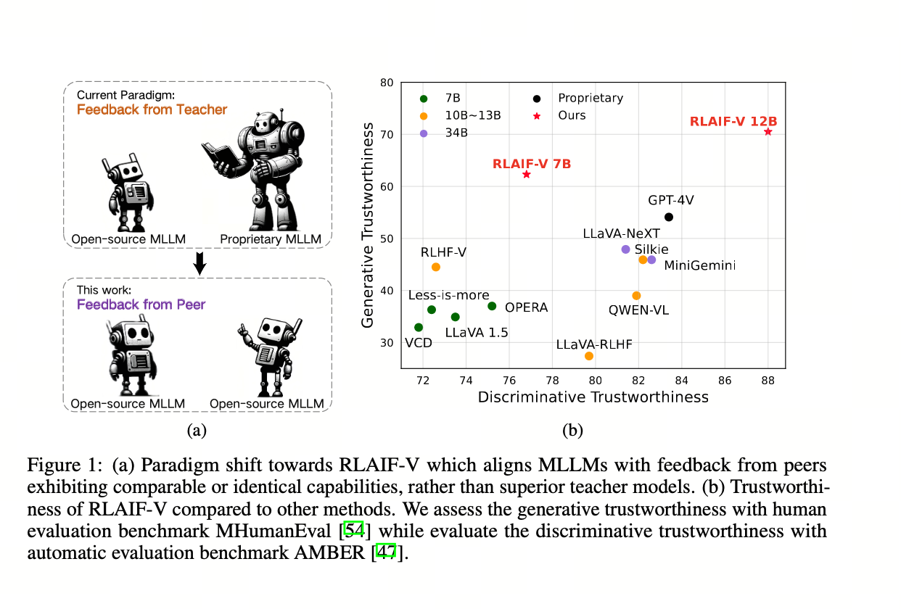

<div align="center" style="font-size: 15pt">


**Aligning MLLMs through Open-Source AI Feedback for Super GPT-4V Trustworthiness**

<a href='https://huggingface.co/datasets/HaoyeZhang/RLAIF-V-Dataset'></a>
<!-- <a href=''></a> -->


</div>


## 🎊News <!-- omit in toc -->

- [2024.05.20] We open-source the code, weights and data of RLAIF-V!


## 📜Brief Introduction <!-- omit in toc -->

We introduce RLAIF-V, a novel framework that aligns MLLMs in a fully open-source paradigm for super GPT-4V trustworthiness.  RLAIF-V maximally exploits the open-source feedback from two key perspectives, including high-quality feedback data and online feedback learning algorithm. Notable features of RLAIF-V include: 

* 💪 **Super GPT-4V Trustworthiness via Open-source Feedback**. By learning from open-source AI feedback, RLAIF-V 12B achieves super GPT-4V trustworthiness in both generative and discriminative tasks.

<table align="center">
    <p align="center">
      
    </p>
</table>


* 🤝 **High-quality Generalizable Feedback Data**. The feedback data used during the first-iteration of RLAIF-V 12B **effectively reduce the hallucination of different MLLMs**.

<table align="center">
    <p align="center">
      
    </p>
</table>


* ⚡️ **Efficient Feedback Learning with Iterative Alignment.** RLAIF-V exihibts both **better learning efficiency and higher performance** compared with the non-iterative approach.

<table align="center">
    <p align="center">
      
    </p>
</table>


## 📌Contents <!-- omit in toc -->

- [Dataset](#dataset)
- [Install](#install)
- [Model Weights](#model-weights)
- [Inference](#inference)
- [Train](#train)
- [Evaluation](#evaluation)
  - [Object HalBench](#object-halbench)
  - [MMHalBench](#mmhalbench)

## Dataset

We present the [RLAIF-V Dataset](https://huggingface.co/datasets/HaoyeZhang/RLAIF-V-Dataset), which is an AI generated preference dataset covering diverse range of tasks and domains. This is the largest open-source multimodal preference datasets which contains more than 50K high-quality comparison pairs.

## Install

1. Clone this repository and navigate to RLAIF-V folder
```bash
git clone https://github.com/RLHF-V/RLAIF-V.git
cd RLAIF-V
```

2. Install package
```bash
conda create -n rlaifv python=3.10 -y
conda activate rlaifv
pip install -e .
```
3. Install required spaCy model
```bash
python -m spacy download en-core-web-trf
```


## Model Weights


| Model           | Description                                                                | Download Link                                                    |
|-----------------|----------------------------------------------------------------------------|--------------------------------------------------------------|
| **RLAIF-V-7B**  | Based on LLaVA 1.5 7B, providing efficient inference. | [🤗RLAIF-V-7B](https://huggingface.co/xiaomanlu/RLAIF-V-7B/) | 
| **RLAIF-V-12B** | Based on OmniLMM-12B, achieving super GPT-4V trustworthiness. | [🤗RLAIF-V-12B](https://huggingface.co/HaoyeZhang/RLAIF-V-12B)                                            |

Note: The RLAIF-V 12B weight is uploading and will be available soon.


## Inference

We provide a simple example to show how to use RLAIF-V.


```python

from chat import RLAIFVChat, img2base64

chat_model = RLAIFVChat('xiaomanlu/RLAIF-V-7B') 
im_64 = img2base64('./examples/test.jpg')
msgs = "Why did the car in the picture stop?"
inputs = {"image": im_64, "question": msgs}
answer = chat_model.chat(inputs)
print(answer)

```


You can also run this example by executing the following script:

```bash
python chat.py
```

<details>
  <summary>
    <b>Inputs and expected outputs of the example</b>
  </summary>


<div align="center">

</div>

**Question:** 

Why did the car in the picture stop?

**Expected outputs:**

In the picture, a car stopped on the road due to the presence of a sheep on the roadway. The car likely stopped to allow the sheep to safely move out of the way or avoid any potential accidents with the animal. This situation highlights the importance of being cautious and attentive while driving, especially in areas where animals may roam near roads.

</details>


## Train

1. Prepare data

Download [RLAIF-V Dataset](https://huggingface.co/datasets/HaoyeZhang/RLAIF-V-Dataset) and put it under `train/data`

If needed, you can modify your data set path [here](muffin/data/data_processors.py#L101) at Line 101.

2. Start training

Run the following command to start training.

```bash
bash ./script/train/llava15_train.sh
```

## Evaluation


### Object HalBench

1. Prepare COCO2014 annotations

The evaluation of Object HalBench relies on the caption and segmentation annotations from the COCO2014 dataset. Please first download the COCO2014 dataset from the COCO dataset's official website.

```bash
mkdir coco2014
cd coco2014

wget http://images.cocodataset.org/annotations/annotations_trainval2014.zip

unzip annotations_trainval2014.zip
```

2. Inference, evaluation, and summarization

Please replace `{YOUR_OPENAI_API_KEY}` with a valid OpenAI api-key.

```bash
# cd RLAIF-V

bash ./script/eval_rlaif_objhal.sh ./RLAIF-V_weight ./results/RLAIF-V ./coco2014/annotations {YOUR_OPENAI_API_KEY}
```


### MMHalBench

1. Prepare MMHal Data

Please download the MMHal evaluation data [here](https://drive.google.com/file/d/1mQyAbeGgRyiVV6qjVkUI1uY_g9E-bDTH/view?usp=sharing), and save the file in `eval/data`. 

2. Run the following script to generate for MMHal Bench:

```bash
# cd RLAIF-V

bash ./script/eval_rlaifv_mmhal.sh ./RLAIF-V_weight ./results/RLAIF-V {YOUR_OPENAI_API_KEY}
```


## Licenses <!-- omit in toc -->


[](https://github.com/tatsu-lab/stanford_alpaca/blob/main/LICENSE)
[](https://github.com/tatsu-lab/stanford_alpaca/blob/main/DATA_LICENSE)

**Usage and License Notices**: The data, code, and checkpoint are intended and licensed for research use only. They are also restricted to uses that follow the license agreement of LLaMA, Vicuna, and Chat GPT. The dataset is CC BY NC 4.0 (allowing only non-commercial use) and models trained using the dataset should not be used outside of research purposes.


## Acknowledgement <!-- omit in toc -->

- [RLHF-V](https://github.com/RLHF-V/RLHF-V): we refer to the scripts included in the repository.
- [LLaVA](https://github.com/haotian-liu/LLaVA): the codebase we built upon.
- [LLaVA-RLHF](https://github.com/llava-rlhf/LLaVA-RLHF): we utilize the MMHal-Bench data and evaluation code constructed by them.
- [Object Hallucination](https://github.com/LisaAnne/Hallucination): we refer to the CHAIR evaluation code included in the repository.
